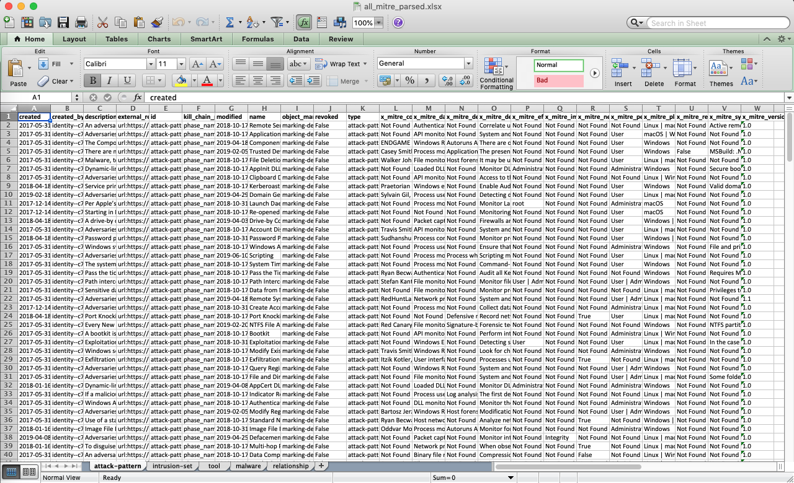

# Full_Attack_TAXII_2_Excel
A python script that takes in the Mitre TAXII feed and parses through each STIX object type (ATT&CK Concept) and outputs the data for each on a separate Excel tab.

The script uses a list of lists that is generated based on the number of categories present, then referenced by index when called.  For each data type (list, str, unicode) in the feed, there is a parser to normalize it for writing to Excel.

Many thanks to the python community for all the online tutorials, whose code has been borrowed/modified to make this possible.

